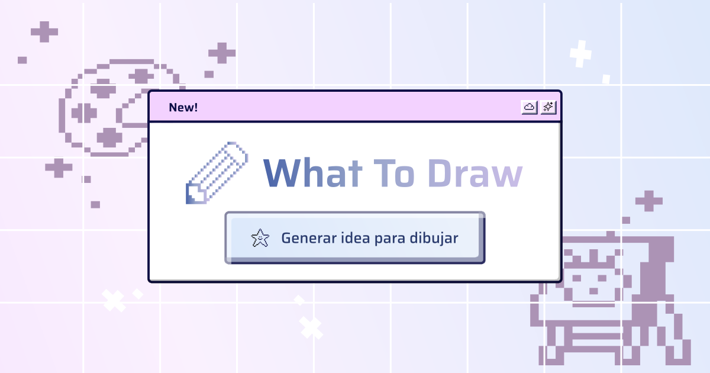

<p align="center">
  <picture>
    <source media="(prefers-color-scheme: dark)" srcset="assets/branding/logo-dark.svg">
    
  </picture>
</p>

<p align="center">Generador de ideas para dibujar: elige una categoría, combina elementos y recibe una idea única para dibujar.</p>

<p align="center">
  <a href="https://malefice-design.github.io/what-to-draw/">🔗 Probar la app</a>
</p>

<p align="center">
  
</p>

## Qué hace

1. Elige una categoría (o "Todos los temas").
2. Elige qué elementos quieres que tenga la idea (personaje, lugar, clima, material, etc.).
3. Genera una frase combinando los elementos elegidos, con opción de deshacer, regenerar y guardar en favoritos.

## Stack

HTML, CSS y JavaScript sin frameworks ni build step. Todo el contenido (categorías, frases) vive en [`data.js`](data.js); la lógica de generación está en [`app.js`](app.js) según [`spec-generador-de-frases.md`](spec-generador-de-frases.md).

## Desarrollo local

```bash
npx serve .
```
